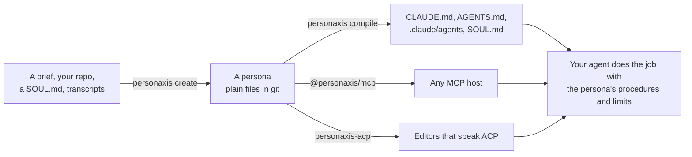

<p align="center">
  <picture>
    <source media="(prefers-color-scheme: dark)" srcset="docs/assets/hero-dark.svg">
    
  </picture>
</p>

<p align="center">
  Write down how a professional does a job as plain files,<br>
  then load it into the coding agent you already use.
</p>

<p align="center">
  <a href="https://www.npmjs.com/package/personaxis"></a>
  <a href="https://github.com/personaxis/personaxis/actions/workflows/ci.yml"></a>
  <a href="https://nodejs.org"></a>
  <a href="https://github.com/personaxis/persona.md/blob/main/docs/SPEC.md"></a>
  <a href="./LICENSE"></a>
</p>

<!-- Demo hidden until the final version: it shows 0.17.0 output (a persona created without a model), which
     no longer matches what create does. Restore this block once docs/assets/demo.svg is regenerated.
<p align="center">
  
</p>

<p align="center"><sub>Real output from personaxis 0.17.0. Paths are shortened, and <code>proof</code> is an excerpt.</sub></p>
-->


A persona is the whole way a professional works: the procedures it follows, the criteria it applies, the
tools it reaches, the knowledge it cites with sources, what it has learned on the job, and the limits it
keeps. Personaxis keeps all of it in a folder you version with git, checks it against the open
[persona.md spec](https://github.com/personaxis/persona.md), and hands it to Claude Code, Codex,
OpenClaw, Hermes, any MCP host, or any editor that speaks ACP.



## Install

```bash
npm i -g personaxis        # Node 20.18.1 or newer
personaxis proof --quick   # a few seconds, offline: the engine's own checks on a throwaway persona
```

Or run it without installing: `npx personaxis <command>`.

<details>
<summary>Windows PowerShell, or from a source checkout</summary>

If a global command prints `running scripts is disabled on this system`, PowerShell is blocking npm's
`.ps1` launcher, as it does for every npm-installed CLI. Fix it once with
`Set-ExecutionPolicy -Scope CurrentUser RemoteSigned`, or call `personaxis.cmd ...` or `npx personaxis ...`.

From source (Node 20.18.1+, pnpm). Every `personaxis <cmd>` in these docs is
`node packages/cli/dist/index.js <cmd>` from a checkout:

```bash
git clone https://github.com/personaxis/personaxis && cd personaxis
pnpm install && pnpm run build
node packages/cli/dist/index.js proof --quick
```

</details>

## Create a persona and load it

**1. Point it at a model.** Any OpenAI-compatible endpoint, hosted or local. A model writes the persona
and runs it; without one, `create` refuses and says how to configure one:

```bash
export PERSONAXIS_ENDPOINT=http://localhost:11434/v1   # Ollama, LM Studio, llama.cpp or a hosted API
export PERSONAXIS_MODEL=qwen3:4b                        # a small local model works; expect weaker results
```

**2. Create it** in any folder:

```bash
personaxis create reviewer --from-prompt "A code reviewer who blocks merges without tests and explains every rejection."
```

In a terminal, the model first asks about what your brief leaves open: questions about the work, at most
fifteen, any of them skippable (`--yes` skips the interview). Then it writes the persona one layer at a
time, and the code checks every answer before it is kept: the
schema, numbers that can move, and a source for every field. You get a folder with the definition
(`personaxis.md`, in ten layers), the compiled document a model reads (`PERSONA.md`), the values that move
as it works (`state.json`), and `creation-report.md`: the words of your brief each field quotes, and every
field the model inferred, with what it inferred it from. Read the inferred list first.

Other ways in: no flag lets you pick a source or start from questions alone, `--from-project` reads your repository, `--from-import` takes a
SOUL.md, a SoulSpec package, a character card or a system prompt, and `--from-transcript` works from
example conversations. `--research` searches the web for the field and keeps each source, with its date, in
`references/`.

**3. Load it into your agent:**

```bash
personaxis compile reviewer --platform claude-code   # writes .claude/agents/reviewer.md
npx -y @personaxis/mcp                               # or serve it to any MCP host (16 tools)
```

**4. Talk to it directly**, to see it work outside your agent:

```bash
personaxis --persona .personaxis/personas/reviewer/personaxis.md
```

## How each agent loads a persona

| Agent | What it reads | Command |
|---|---|---|
| Claude Code | `PERSONA.md` through `@PERSONA.md` in `CLAUDE.md`, or `.claude/agents/<slug>.md`, or MCP | `compile --platform claude-code`, `@personaxis/mcp` |
| Codex | `PERSONA.md` through `AGENTS.md`, or `.codex/agents/<slug>.toml`, or MCP | `compile --platform codex`, `@personaxis/mcp` |
| Cursor and editors that read `AGENTS.md` | the `AGENTS.md` baseline | `compile --platform codex` |
| OpenClaw | `SOUL.md` | `compile --platform openclaw` |
| Hermes | `.hermes/SOUL.md` | `compile --platform hermes` |
| Editors that speak ACP | the persona runs as the agent | `personaxis-acp` |
| Anything over HTTP | an `agents.md` endpoint | `personaxis serve --persona <path>` |

MCP registration is documented and tested for Claude Code and Codex
([guide](docs/integrations/claude-code-mcp.md)). Cursor is reached through `AGENTS.md`; there is no tested
MCP snippet for it yet.

## What a persona brings to a job

| It has | Where it lives | How the agent reaches it |
|---|---|---|
| Skills | `skills/<name>/SKILL.md` | `use_skill` loads the method before the work starts |
| Services | `.personaxis/services/<name>.json` | `run_service` runs a multi-step job; every step must leave the files it declares, and the run keeps a journal |
| References | `references/` | `read_file`, by the path the index gives it |
| Sub-personas | `personas/` inside the persona | `delegate`, for work one of them is made for |
| Memory | its own append-only, hash-chained store | `memory_search`, before it says it does not remember |

It also gets `ask_person`, for a missing fact it should not invent, and `check_page`, which runs a page it
just built and reads back the line that failed.

## Why you can trust a loaded persona

These hold in code, so they hold when the model is wrong or under attack:

- Every value that can change stays inside the range the persona declares. This is theorem T1, checked on
  2,306,140 generated adversarial cases with 0 counterexamples.
- A tool call that no permission covers does not run.
- Every turn and every change goes into a hash-chained record. History replays deterministically, and a
  tampered entry is located by its position in the chain.
- `@personaxis/evals` runs 19 conformance scenarios with no API keys on every CI build.

What the engine does not decide is whether the model makes the right call. A small open model will
sometimes answer from memory what its own service answers better. That is why the limits live in the tool
layer: a wrong decision still cannot run a forbidden action.

## Everyday commands

| Command | What it does |
|---|---|
| `create [slug]` | Build a persona from an interview, a brief, a project, an import or transcripts |
| `validate` and `lint` | Check the schema and the universal rules; `lint` gives a fix for each finding |
| `compile [slug] --platform <p>` | Write the document an agent reads |
| `state show \| mutate \| rewind` | Inspect, adjust (clamped and logged) or undo the persona's moving values |
| `serve --persona <path>` | Serve a persona over HTTP for agents that do not speak MCP |
| `proof [--quick]` | Run the engine's checks offline |

Every command, flag and exit code is in [`docs/commands/`](docs/commands/README.md).

## Packages

| Package | What it is |
|---|---|
| `personaxis` | the CLI |
| `@personaxis/core` | the engine: state, the loop, the record, Genesis |
| `@personaxis/spec` | the schemas, the validator and the universal rules |
| `@personaxis/protocol` | the transport between a front end and the engine, and the ACP bridge |
| `@personaxis/mcp` | the MCP server |
| `@personaxis/sdk` | run a persona inside your own Node or TypeScript backend |
| `@personaxis/evals` | the conformance suite |
| `@personaxis/tui` | the terminal interface |

All eight move together on one version.

## Documentation

| Guide | What it covers |
|---|---|
| [Getting started](docs/guides/getting-started.md) | install, configure a model, create, load into your agent |
| [Creating personas](docs/guides/creating-personas.md) | which way in for which input, and how to read the creation report |
| [Integrations](docs/integrations/README.md) | Claude Code, Codex, OpenClaw, Hermes, MCP, ACP and HTTP |
| [How it works](docs/HOW_IT_WORKS.md) | the files of a persona, one turn, and what is enforced |
| [Guarantees](docs/GUARANTEES.md) | what is tested, with numbers, and what is not |
| [Commands](docs/commands/README.md) | every command, flag and exit code |

## Status

The spec is `1.1.0`, and a persona written for `1.0.0` still validates. This release has no hosted hub to
publish and pull personas, no bench that measures how much a persona improves an agent on each model, and no
web studio, and none of their commands are in the package.
[`docs/GUARANTEES.md`](docs/GUARANTEES.md) lists what is measured and what is not.

## Contributing

See [CONTRIBUTING.md](CONTRIBUTING.md). Every pull request runs the full test suite, the repository gates,
and a check that no commit adds personal data.

## License

MIT.
