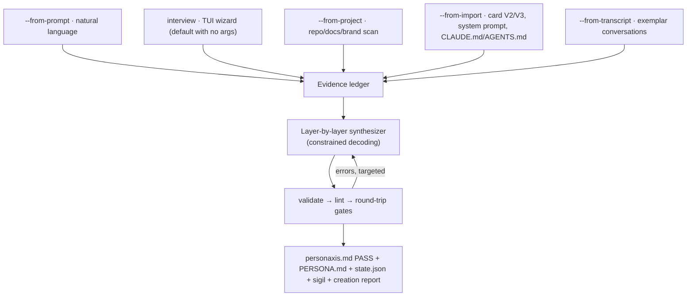

# Genesis, Creating an AI Persona from Zero (`personaxis create`)

> **Status:** design document (F6.0, 2026-07-08). Implemented in F6.6 as
> `packages/core/src/genesis/` + `packages/cli/src/commands/create.ts` + the TUI wizard.
> Genesis is the front door of the product: every entry case a person can arrive with
> must produce a **validated, governed, provenance-carrying** persona, never a prose blob.

## 1. Design principle: every number earned, not invented

The spec's differentiator is quantitative (means, ranges, weights, bands). LLM
self-report of personality numbers is known-unreliable on smaller models
(RESEARCH.md §2.5), so Genesis never lets a model "make up a 0.72". Instead every
quantitative field must trace to an **evidence item**:

```
EvidenceItem = { id, kind: answer | document | dialogue | imported-field | default,
                 source (provenance), excerpt, mappedFields[{ path, value, rule }] }
```

The **creation report** (`.personaxis/[personas/<slug>/]creation-report.md` + JSON)
lists, for every quantitative field, the evidence chain that produced it, the C6
contribution, and the file an auditor or a buyer reads to trust the persona.
Provenance completeness (fields with evidence ÷ quantitative fields) is 1.0 by
construction; the report also grades evidence strength (direct answer > document
inference > genre default).

## 2. The five entry modes (one command, every case)



| Mode | Input | Evidence extraction |
|---|---|---|
| `--from-prompt "<NL>"` | one NL brief | LLM elicitation pass decomposes the brief into evidence items (role, tone, boundaries, domain); unstated dimensions → interview-lite follow-ups (interactive) or labeled genre defaults (`--yes`) |
| **interview** (default TTY) | adaptive Q&A | the psychometric item bank (§3); every answer is one evidence item |
| `--from-project [path]` | repo / docs / brand assets | reuses `resource-manifest.ts` scan + targeted reads; extracts role, conventions, vocabulary, constraints (the CMO/Clio case, generalized) |
| `--from-import <file>` | character card V2/V3 (PNG tEXt `chara`/`ccv3` or JSON), bare system prompt, CLAUDE.md / AGENTS.md | field adapters map card fields (`description/personality/scenario/mes_example` etc.) to layers; free prose goes through the decompile path; card numbers are never trusted blindly, mapped with rule tags |
| `--from-transcript <file>` | conversation log | style/values induction: the synthesizer proposes the persona that best explains the exemplars; low-confidence dimensions flagged in the report |

Modes compose: `--from-project --from-prompt "make it more formal"` merges ledgers
(later evidence wins per field, recorded as an override in the report).

## 3. Psychometric grounding (the interview item bank)

Fixed, versioned item bank (`core/src/genesis/item-bank.ts`), mapped by construct, 
not administered to the model, administered to the **human** (or answered from
documents in non-interactive modes):

- **Traits (personality layer):** short BFI-2/TIPI-style items per declared trait
  dimension; Likert 1–5 → affine map to `mean`; answer variance/confidence → `range`
  width (confident = narrow envelope); bands from the author's tolerance question
  ("how far may this flex before it's a different persona?").
- **Values (values_and_drives):** Schwartz-style ranking of the candidate value set →
  rank-to-weight map (monotone, documented); `type: governance` reserved for
  safety-class values (A2 scope note in MATH_CORE.md); universals U6/U7 injected
  always (safety ≥ 0.90, governance).
- **Virtues / hard limits (character, self_regulation):** scenario dilemmas ("a user
  insists X; comply?") → enforcement levels and `prohibited_behaviors`; the three
  universal hard limits are non-negotiable and pre-filled.
- **Identity / persona layers:** role, display name, register, addressing style, 
  direct questions; `expression` prose drafted by the synthesizer FROM the answers,
  band variants included when bands are declared.
- Adaptive: a dimension covered by prior evidence (project scan, card import) is
  skipped or asked as confirmation only, the interview shortens as evidence grows.

## 4. The synthesizer (layer-by-layer, constrained, validated)

- One pass per spec block (ANATOMY layers → CHANGE GOVERNANCE → RUNTIME CONTRACT),
  each pass a **constrained-decoding** call (JSON Schema per layer, the proven
  appraiser pattern in `appraisal.ts`) taking: the evidence ledger + already-fixed
  layers + the layer's schema slice. Small-model friendly by design.
- Deterministic post-pass: universals injected/verified, envelope sanity
  (`lo ≤ mean ≤ hi`, bands ordered), cross-layer coherence (virtue `refs:` resolve).
- **Repair loop:** `validate` + `lint` run after synthesis; each error feeds back as a
  targeted instruction (the exact failing field + rule, Clio-style) for a bounded
  number of repair rounds (default 3), never silent degradation; unresolved →
  explicit failure with the report of what's missing.
- Offline path: with the `local` provider Genesis runs fully offline; with no model at
  all, interview mode still works (answers map deterministically; only free-prose
  drafting falls back to templates).

## 5. Quality gates (all mandatory before writing)

1. `validate` → **PASS** (five-state validator; never write a failing persona).
2. `lint` → no MUST violations; SHOULD warnings surfaced in the report.
3. **Round-trip stability:** compile → decompile → diff; quantitative fields must
   survive; drift in prose fields reported.
4. Optional behavioral smoke (`--smoke`, BYOK): N in-character probes + judge score,
   recorded in the report (the E5 instrument, single-persona edition).

## 6. Surfaces

- CLI: `personaxis create [slug] [--from-* …] [--yes] [--smoke] [--json]`, exit codes
  follow the validator convention; `--json` emits the report data.
- TUI wizard (Pillar C): the interview as a themed, responsive Ink flow, progress by
  layer, live preview pane of the growing spec (sigil + envelope bars), review screen
  with per-answer edit, final gate results. Degrades to plain prompts on `NO_COLOR`/
  non-TTY.
- `init` remains the template scaffolder (fast, no LLM); `create` is the guided/
  evidence path; docs cross-link them (`init` for empty scaffolds, `create` for real
  personas). `use` stays deprecated.

## 7. Failure honesty

Genesis never outputs a persona that fails validation; partial evidence yields either
more questions (interactive) or labeled defaults (non-interactive), every default is
visible in the creation report as `kind: default`. If the provider is unreachable
mid-synthesis, completed layers are kept in a resumable draft
(`.personaxis/.genesis-draft.json`), never a half-written persona file.
