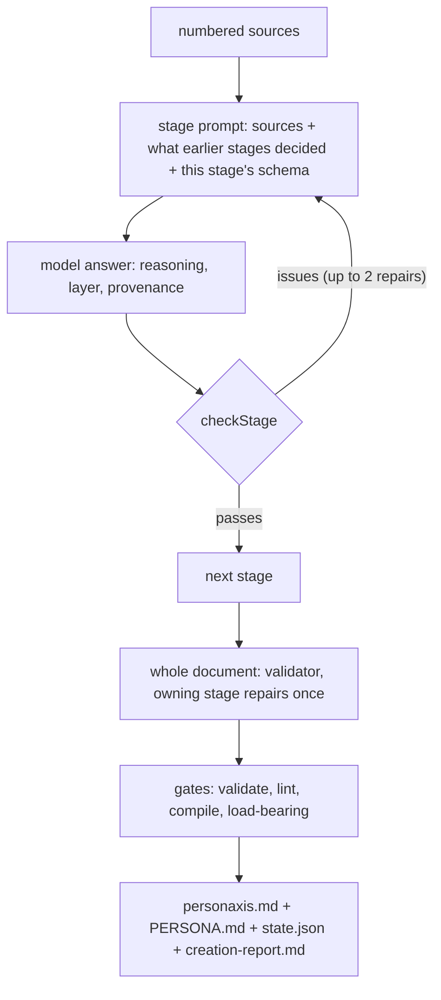

# Genesis: creating a persona (`personaxis create`)

Genesis is implemented in `packages/core/src/genesis/` and `packages/cli/src/commands/create.ts`. A
model writes every field of the persona from numbered sources, one layer at a time, and the code checks
every answer before it is kept. The command reference is [`create`](../commands/create.md); this page
explains how it works.

## The split: the model writes, the code checks

Since 2026-10-07 there is no template, no default value and no heuristic builder. What a persona says
(its purpose, its traits and their numbers, its limits, its voice) is written by a model. What the code
does is verify and enforce: the schema, that numbers can move, that every field names where it came from,
that a quote is really in its source, and the universal rules no persona may drop. Without a model,
`create` refuses and says how to configure one (`ModelRequiredError`), and nothing is written.

## Sources

Everything the model may use is a numbered source (`genesis/sources.ts`):

```
Source = { id: S1.., kind: brief | project | import | transcript | research | answer, label, text, url?, retrieved? }
```

| Source, in this order | Becomes |
|---|---|
| this folder, always (`folderContext` in `commands/create.ts`): its tree, the files that explain it and the personas already in it, bounded; nothing in the home folder or an empty one | one `project` source |
| what you want it for: the command's argument, or one question in a terminal | one `brief` source |
| `--from-import <file>` | one `import` source: a character card V2/V3 (PNG or JSON) with its fields labelled, a SOUL.md or SoulSpec package with `IDENTITY.md` and `soul.json`, or a system prompt, CLAUDE.md or AGENTS.md as written (`genesis/imports.ts`) |
| `--from-transcript <file>` | one `transcript` source |
| `--research` | one `research` source per page kept, with its URL and the day it was read |
| the interview (in a terminal, after the other sources) | one `answer` source with every question answered |

Every source is numbered and handed to the model together; what the person says wins over the folder
when they disagree, and the interview resolves what is still unclear. No field is mapped from a file's
layout; the model reads the file and cites it. The folder read leaves out the persona being created (an
agent's re-run would otherwise list its own earlier write as a colleague) and a file given with
`--from-import`, which is read once, as the import.

## The interview

In a terminal (not with `--yes` or `--json`), after the other sources are read, a model interviews the
person about what they leave open (`genesis/interview.ts`). Each round it reads the sources and the
answers so far, says how much each stage is covered, and writes at most five questions, at most fifteen
in all; it asks none when the rest can be inferred. It is told to ask about real work rather than
adjectives (tacit knowledge comes out of cases: "the last change you rejected, and why"), never to ask for
ratings or about the format of the persona, and not to repeat a question asked, answered or skipped. Each
question names the stage it informs and a line saying what is missing, which the person reads first. The
code checks each round (a known stage, no repeats, the caps) and asks again with the exact problems, as
authoring does.

Every question can be skipped; what is skipped is inferred, and the report lists every question with
whether it was answered. The answers become one source. They are saved as they are given
(`genesis/draft.ts`) with a fingerprint of the sources, so leaving part-way loses nothing and a later run
over the same sources offers to continue; the draft is deleted when the persona exists.

## Stages


```mermaid
flowchart TD
  S["numbered sources"] --> A["stage prompt: sources + what earlier stages decided + this stage's schema"]
  A --> M["model answer: reasoning, layer, provenance"]
  M --> C{"checkStage"}
  C -- "issues (up to 2 repairs)" --> A
  C -- "passes" --> N["next stage"]
  N --> V["whole document: validator, owning stage repairs once"]
  V --> G["gates: validate, lint, compile, load-bearing"]
  G --> O["personaxis.md + PERSONA.md + state.json + creation-report.md"]
```

Eleven stages, in this order, each deciding its own top-level keys (`genesis/stages.ts`): identity (with
metadata), personality, values and drives, character, affect, cognition, memory, metacognition,
self-regulation, persona, and governance (with improvement policy, security, permissions, verification,
agent budget and runtime). Character comes after personality and values because it refers to them.

Each prompt (`stagePrompt`) carries the sources, what earlier stages decided, the stage's guidance, the
profile's stance and the JSON Schema of the answer. The answer writes `reasoning` first, then the layer,
then `provenance`: one entry per field, either `{source, quote}` with the exact words or `{inferred}`
saying what in the sources or the job the value follows from. The prompt is deterministic for the same
inputs, which is what lets the `agent` provider replay answers already written.

## What `checkStage` refuses

- A key of another stage, or a block the spec schema rejects.
- A universal rule broken (honesty, safety, the three universal hard limits), checked per stage.
- A field without provenance, or a provenance at a layer's root covering everything at once.
- A quote that is not in the source it cites.
- A research source as the origin of identity, character or self-regulation: the web may inform knowledge
  and procedures, never who the persona is or what it must never do (E65).
- A display name that repeats the authoring prompt, a self-concept not written to the persona ("you ..."),
  a voice exemplar no source contains.
- A number that cannot move: a mean outside its range, or a range that never crosses a band, so the value
  could never change the compiled document. Personality and affect envelopes must declare a `half_life`,
  so the persona returns to its baseline by itself (E127).

A failing answer goes back to the model with the exact issues, up to two times; after that `create`
stops with `GenesisStageError`, naming the stage and the issues.

## Coherence

Each stage sees only its own part, so after the eleven a model reads the whole persona against its
sources. The task is mechanical on purpose: list every rule a source states (never, always, only, must,
or a limit said another way), with its exact words, and the field of the persona that keeps it; and
list two fields that contradict each other, if any. The code checks each quote against its source and
each field path against the persona (a list item as `path.N`), and the field must share words with the
rule. A rule no field keeps goes back to the stage the reading names, and that stage's answer must then
carry it: the same repairs ask for it, and if it is still missing when they run out, the answer is kept
and the report lists the rule under **Coherence** as not yet in the persona. Measured on 2026-10-07:
an interview answer, "Currency in floats is never acceptable", reached no field until this reading
sent it back, and the first time it did, the stage answered without it.

After that, the whole document goes through the validator, and any issue goes back once to the stage
that owns it.

## Research is a source, not a definition

Every result passes the untrusted-content door first (`ingestUntrusted`, in `genesis/research.ts`),
because the injection scan that protects an agent turn does not cover `create`: a page the scan calls
malicious is dropped, a suspicious one is kept and tagged. What remains becomes `research` sources, and a
note in `references/` lists every page under its query with the provider and the date.

## Gates

All four must pass before anything is written (`create.ts`):

1. `validate` returns PASS (the five-state validator; a failing persona is never written).
2. `lint` has no errors; warnings go in the report.
3. The reference for `PERSONA.md` assembles from the spec (the document itself is written by the model
   next, and held to that reference).
4. The load-bearing check: no mutable coordinate is left whose value cannot change the compiled document.

Each stage was already checked, so a failing gate here is a bug, reported as one, and nothing is written.

## The creation report

`creation-report.md`, beside the persona, lists the sources, then every **inferred** field with what it
was inferred from (the review list), then the interview's questions, answered or skipped, then each stage with its reasoning, how many repairs it needed and
each field's origin. Anything Genesis worked around (a web search that returned nothing) is listed under
**Worked around**, never under a passed gate.

## Profiles

`--profile regulated | standard | research` (`genesis/profiles.ts`) is guidance every stage prompt
carries: how wide ranges should be, how fast values return to baseline, and which layers a person must
approve changes to. The model sets each number with that stance; the profile writes no value itself.

## Surfaces

- CLI: `personaxis init [intent]` for this folder's persona and `personaxis create <name> [intent]` for
  another beside it, with `--from-import`, `--from-transcript`, `--research`, `--profile`, `--yes`,
  `--json`, `--provider`, `--no-compile`. Exit codes follow the validator convention.
- `--provider agent` hands each stage to the coding agent running the command, one prompt file at a time.
- The first time `personaxis` opens in a folder without a persona, it offers `init` (after setting up a
  model if there is none). There is no template and no starter persona.
