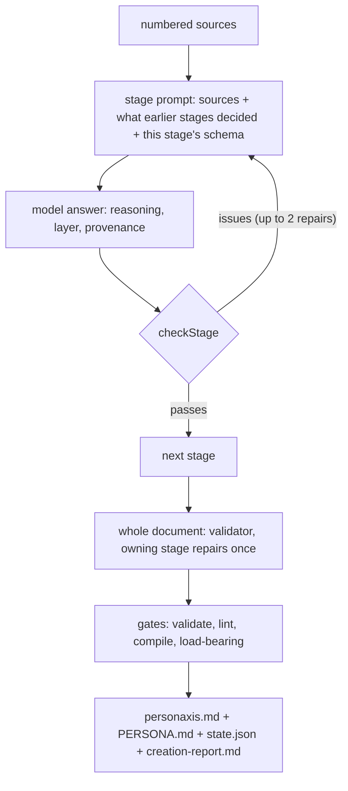

# Genesis: creating a persona (`personaxis create`)

Genesis is implemented in `packages/core/src/genesis/` and `packages/cli/src/commands/create.ts`. A
model writes every field of the persona from numbered sources, one layer at a time, and the code checks
every answer before it is kept. The command reference is [`create`](../commands/create.md); this page
explains how it works.

## The split: the model writes, the code checks

Since 2026-10-07 there is no template, no default value and no heuristic builder. What a persona says
(its purpose, its traits and their numbers, its limits, its voice) is written by a model. What the code
does is verify and enforce: the schema, that numbers can move, that every field names where it came from,
that a quote is really in its source, and the universal rules no persona may drop. Without a model,
`create` refuses and says how to configure one (`ModelRequiredError`), and nothing is written.

## Sources

Everything the model may use is a numbered source (`genesis/sources.ts`):

```
Source = { id: S1.., kind: brief | project | import | transcript | research | answer, label, text, url?, retrieved? }
```

| Flag | Becomes |
|---|---|
| `--from-prompt "<brief>"` | one `brief` source |
| interview (default in a terminal) | one `answer` source with every question and answer |
| `--from-project [dir]` | one `project` source with the files it read (README, CLAUDE.md, AGENTS.md, SOUL.md, package.json, docs) |
| `--from-import <file>` | one `import` source: a character card V2/V3 (PNG or JSON) with its fields labelled, a SOUL.md or SoulSpec package with `IDENTITY.md` and `soul.json`, or a system prompt, CLAUDE.md or AGENTS.md as written (`genesis/imports.ts`) |
| `--from-transcript <file>` | one `transcript` source |
| `--research` | one `research` source per page kept, with its URL and the day it was read |

Flags compose: every source is numbered and handed to the model together. No field is mapped from a
file's layout; the model reads the file and cites it.

## Stages


```mermaid
flowchart TD
  S["numbered sources"] --> A["stage prompt: sources + what earlier stages decided + this stage's schema"]
  A --> M["model answer: reasoning, layer, provenance"]
  M --> C{"checkStage"}
  C -- "issues (up to 2 repairs)" --> A
  C -- "passes" --> N["next stage"]
  N --> V["whole document: validator, owning stage repairs once"]
  V --> G["gates: validate, lint, compile, load-bearing"]
  G --> O["personaxis.md + PERSONA.md + state.json + creation-report.md"]
```

Eleven stages, in this order, each deciding its own top-level keys (`genesis/stages.ts`): identity (with
metadata), personality, values and drives, character, affect, cognition, memory, metacognition,
self-regulation, persona, and governance (with improvement policy, security, permissions, verification,
agent budget and runtime). Character comes after personality and values because it refers to them.

Each prompt (`stagePrompt`) carries the sources, what earlier stages decided, the stage's guidance, the
profile's stance and the JSON Schema of the answer. The answer writes `reasoning` first, then the layer,
then `provenance`: one entry per field, either `{source, quote}` with the exact words or `{inferred}`
saying what in the sources or the job the value follows from. The prompt is deterministic for the same
inputs, which is what lets the `agent` provider replay answers already written.

## What `checkStage` refuses

- A key of another stage, or a block the spec schema rejects.
- A universal rule broken (honesty, safety, the three universal hard limits), checked per stage.
- A field without provenance, or a provenance at a layer's root covering everything at once.
- A quote that is not in the source it cites.
- A research source as the origin of identity, character or self-regulation: the web may inform knowledge
  and procedures, never who the persona is or what it must never do (E65).
- A display name that repeats the authoring prompt, a self-concept not written to the persona ("you ..."),
  a voice exemplar no source contains.
- A number that cannot move: a mean outside its range, or a range that never crosses a band, so the value
  could never change the compiled document. Personality and affect envelopes must declare a `half_life`,
  so the persona returns to its baseline by itself (E127).

A failing answer goes back to the model with the exact issues, up to two times; after that `create`
stops with `GenesisStageError`, naming the stage and the issues. When every stage passes, the whole
document goes through the validator, and any issue goes back once to the stage that owns it.

## Research is a source, not a definition

Every result passes the untrusted-content door first (`ingestUntrusted`, in `genesis/research.ts`),
because the injection scan that protects an agent turn does not cover `create`: a page the scan calls
malicious is dropped, a suspicious one is kept and tagged. What remains becomes `research` sources, and a
note in `references/` lists every page under its query with the provider and the date.

## Gates

All four must pass before anything is written (`create.ts`):

1. `validate` returns PASS (the five-state validator; a failing persona is never written).
2. `lint` has no errors; warnings go in the report.
3. A first compile succeeds (the stage-1 assembler accepts the spec).
4. The load-bearing check: no mutable coordinate is left whose value cannot change the compiled document.

Each stage was already checked, so a failing gate here is a bug, reported as one, and nothing is written.

## The creation report

`creation-report.md`, beside the persona, lists the sources, then every **inferred** field with what it
was inferred from (the review list), then each stage with its reasoning, how many repairs it needed and
each field's origin. Anything Genesis worked around (a web search that returned nothing) is listed under
**Worked around**, never under a passed gate.

## Profiles

`--profile regulated | standard | research` (`genesis/profiles.ts`) is guidance every stage prompt
carries: how wide ranges should be, how fast values return to baseline, and which layers a person must
approve changes to. The model sets each number with that stance; the profile writes no value itself.

## Surfaces

- CLI: `personaxis create [slug] [--from-* ...] [--deep] [--profile <name>] [--research] [--yes] [--json]`.
  Exit codes follow the validator convention, and `--json` emits the spec, gates, sources and stages.
- `--provider agent` hands each stage to the coding agent running the command, one prompt file at a time.
- `init` stays the template scaffolder (fast, no model); `create` is the authored path.
