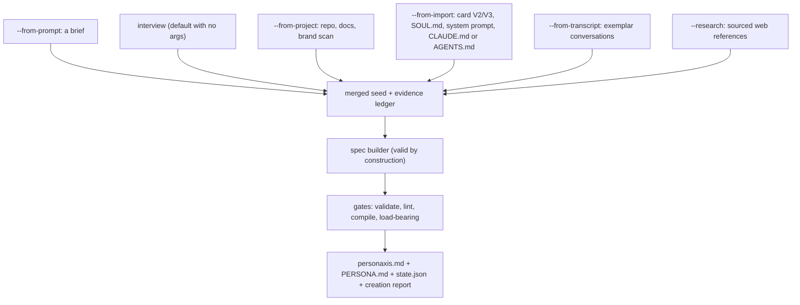

# Genesis: creating a persona from nothing (`personaxis create`)

Genesis is implemented in `packages/core/src/genesis/` and `packages/cli/src/commands/create.ts`.
Every entry case produces a validated persona that carries its provenance. The command reference is
[`create`](../commands/create.md); this page explains how it works.

## Every number is earned, not invented

Asking a model to report its own personality numbers is unreliable on smaller models, so Genesis never
lets a model make up a 0.72. Every quantitative field traces to an evidence item:

```
EvidenceItem = { id, kind: answer | document | dialogue | imported-field | synthesis | default,
                 source (provenance), excerpt, mappedFields[{ path, value, rule }] }
```

The creation report (`creation-report.md`, plus JSON, beside the persona) lists the evidence chain for
every quantitative field. It grades the evidence: a direct answer outranks a document inference, which
outranks a default. Its "Defaults" section lists every number that was not earned from evidence, and
anything Genesis had to work around (no model, an extractor that failed, a web search that returned
nothing) is listed under "Worked around".

## The entry modes


```mermaid
flowchart TD
  P["--from-prompt: a brief"] --> E
  I["interview (default with no args)"] --> E
  J["--from-project: repo, docs, brand scan"] --> E
  M["--from-import: card V2/V3, SOUL.md, system prompt, CLAUDE.md or AGENTS.md"] --> E
  T["--from-transcript: exemplar conversations"] --> E
  R["--research: sourced web references"] --> E
  E["merged seed + evidence ledger"] --> B["spec builder (valid by construction)"]
  B --> G["gates: validate, lint, compile, load-bearing"]
  G --> O["personaxis.md + PERSONA.md + state.json + creation report"]
```

| Mode | Input | Evidence extraction |
|---|---|---|
| `--from-prompt "<brief>"` | a natural-language brief | one constrained model call turns the brief into a seed; every number must carry an evidence quote, and dimensions without evidence are omitted |
| interview (default in a terminal) | adaptive Q&A | the item bank below; every answer is one evidence item |
| `--from-project [dir]` | a repo, docs or brand assets | the project's own docs (README, CLAUDE.md, ...) feed the same extraction |
| `--from-import <file>` | a character card V2/V3 (PNG or JSON), a SOUL.md or SoulSpec package, a system prompt, CLAUDE.md or AGENTS.md | adapters map card fields to evidence deterministically; free prose goes to the extractor; card numbers are never copied blindly |
| `--from-transcript <file>` | a conversation log | the extractor proposes the persona that best explains the exemplars; low-confidence dimensions are flagged in the report |
| `--research` | the web, through the configured search provider | writes notes to `references/` with each source and its date |

Modes compose: `--from-project --from-prompt "make it more formal"` merges the contributions in order
(`mergeSeed`). Later evidence wins per scalar field, maps and lists are unioned, and every override
stays visible in the report because both evidence items remain. With no model, a labeled heuristic
baseline (kind `default`) is used and recorded; Genesis never fakes inference.

## Research writes references, nothing else

A research contribution writes exactly one seed field, `references`, and it holds file paths
(`genesis/research.ts`). Everything the web said becomes a note on disk and evidence in the ledger, so
a page cannot define the persona's character, its hard limits or a number: there is no field for it to
land in. Every result passes the untrusted-content door first (`ingestUntrusted`), because the
injection scan that protects an agent turn does not cover `create`.

## The interview item bank

A fixed, versioned bank (`core/src/genesis/item-bank.ts`), mapped by construct. It is administered to
the human (or answered from documents in non-interactive modes), never to the model:

- Traits: short BFI-2 and TIPI-style items per trait dimension. A Likert 1 to 5 answer maps to the
  mean, answer confidence maps to the range width (confident means a narrow envelope), and the
  author's tolerance question sets the bands.
- Values: a Schwartz-style ranking of the candidate values maps to weights with a monotone, documented
  map. `type: governance` is reserved for safety-class values, and the universals (safety at least
  0.90, governance) are always injected.
- Virtues and hard limits: scenario dilemmas map to enforcement levels and `prohibited_behaviors`. The
  three universal hard limits are pre-filled and not negotiable.
- Role, name, register and addressing style are direct questions. The `expression` prose for each band
  is drafted from the answers.
- A dimension already covered by other evidence (a project scan, a card import) is skipped or asked as
  a confirmation, so the interview shortens as evidence grows.

The default interview asks 12 questions; `--deep` asks all 20. Answers are saved as you give them
(`genesis/draft.ts`), the next run offers to continue, and the draft is deleted when the persona exists.

## Valid by construction

The spec builder (`genesis/spec-builder.ts`) renders the document from the merged seed. It clamps every
number and re-imposes every universal downstream of whatever the extractor proposed (envelope sanity
`lo ≤ mean ≤ hi`, ordered bands, resolvable `refs:`). Before it does, `fillSeedExpressions`
(`expression-synth.ts`) gives every trait that lacks per-band prose the deterministic construct table,
so no number leaves Genesis decorative, and the ledger records that prose as `synthesis` rather than
earned. The starting values of range, edit policy and half-life come from the profile
(`genesis/profiles.ts`: `regulated`, `standard` or `research`); an interview answer or an extracted
value with evidence always wins over the profile's default.

## Gates

All four must pass before anything is written (`create.ts`):

1. `validate` returns PASS (the five-state validator; a failing persona is never written).
2. `lint` has no errors; warnings go in the report.
3. A first compile succeeds (the stage-1 assembler accepts the spec).
4. The load-bearing check: the persona compiles at each band and no mutable coordinate is left whose
   value cannot change the compiled document.

Partial evidence produces either more questions (interactive) or labeled defaults (`--yes`), and each
default shows in the report as `kind: default`. If the provider is unreachable, `create` still produces
the persona from labeled defaults, and the report says so.

## Surfaces

- CLI: `personaxis create [slug] [--from-* ...] [--deep] [--profile <name>] [--research] [--yes] [--json]`.
  Exit codes follow the validator convention, and `--json` emits the spec, gates and provenance.
- The interview runs as terminal prompts; with no terminal, pass a `--from-*` flag and `--yes`.
- `init` stays the template scaffolder (fast, no model); `create` is the evidence path.
